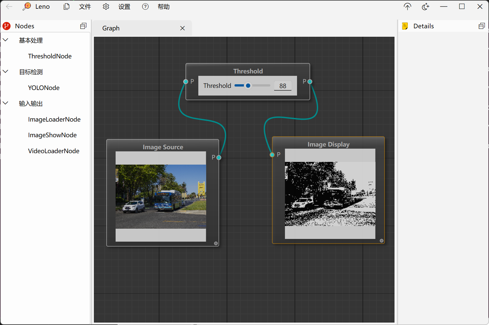

<div align=center>
   

# Leno

**Leno is an image processing node editor implemented with Qt and OpenCV.**

</div>

## Introduction

<div align=center>
   
</div>

## Get Started

<div style="background-color: #fff3cd; border-left: 4px solid #ffeeba; padding: 10px; margin: 20px 0;">
  <strong>⚠️ Warning:</strong> This software has only been tested on Qt6 with CMake for Windows. Please handle other versions at your own risk.
</div>

### Requirements

+ [**OpenCV**](https://github.com/opencv/opencv): Open Source Computer Vision Library
  😎❤️⬆️ *Please build OpenCV by yourself*

+ [❤️**ElaWidgetTools**](https://github.com/Liniyous/ElaWidgetTools): A Fluent Design Style Qt Component Library
+ [🥰**nodeeditor**](https://github.com/paceholder/nodeeditor): Qt Node Editor Library

### Build

+ clone the repository

```bash
git clone --recursive https://github.com/liaozhangsheng/Leno.git
```

+ open the project with your IDE (e.g. Qt Creator)

+ build the project

## TODO

- [ ] Add more image processing nodes
- [ ] Multi-flowchart management
- [ ] Add nodes via plugins
- [ ] Add image processing workflow save and load functionality
- [ ] Add GPU acceleration
- [ ] More beautiful UI design
- [ ] i18n support
